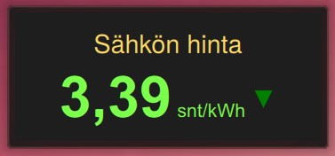
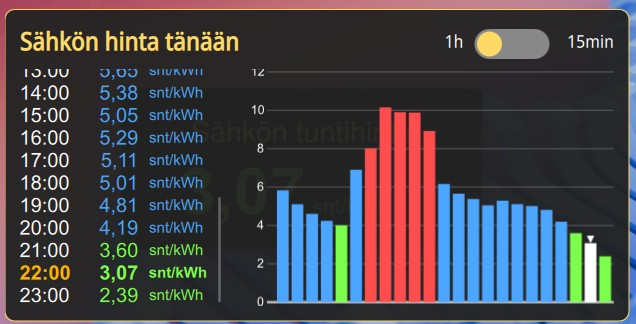
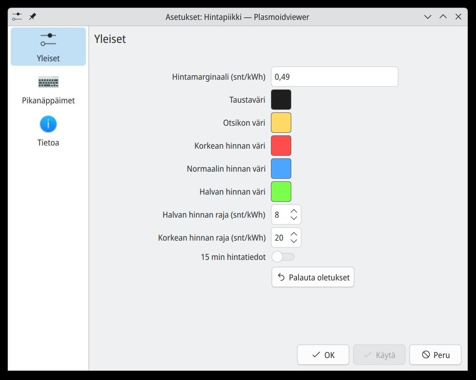

# Pörssisähkö-applet KDE Plasma 6:lle

## 📖 Kuvaus
**Hintapiikki** on KDE Plasma 6 ‑appletti, joka näyttää **pörssisähkön spot-hinnan** suoraan työpöydällä.  
Perusnäkymässä näkyy sähkön kokonaishinta (spot-hinta + sähkösopimuksen marginaali) ja hinnan perässä oleva nuoli kertoo, mihin suuntaan hinta on muuttumassa.  

Applettia klikkaamalla avautuu popup, jossa näet koko vuorokauden hintatiedot sekä suuntaa-antavan graafin. Popupissa hintatietoja voi selata scrollaamalla.  
Hinta/hinnat näytetään joko **tunneittain** tai **varteittain (15 min)**.

---

## ✨ Ominaisuudet
- Näyttää pörssisähkön spot-hinnan tunnin tai 15 minuutin tarkkuudella.
- Mahdollisuus lisätä oma marginaali (snt/kWh).
- Värit eri hintatasoille:
  - **Halpa hinta**
  - **Normaali hinta**
  - **Korkea hinta**
- Konfiguroitavat raja-arvot halvalle ja kalliille hinnalle.
- Taustan ja otsikon värit valittavissa.
- Popup-näkymä graafilla ja scrollattavilla hintatiedoilla.

---

## 🛠️ Asennus
1. Kloonaa repositorio ja asenna appletti:
   ```bash
   git clone https://github.com/kettumatti/hintapiikki.git
   cd hintapiikki
   kpackagetool6 --type=Plasma/Applet --install ./
   ```
2. Siirry työpöydän muokkaustilaan ja lisää **Hintapiikki** työpöydälle

---

## 📸 Kuvakaappaukset

<br>
*Appletin perusnäkymä työpöydällä.*

<br>
*Koko vuorokauden hintatiedot ja graafi popup-ikkunassa.*

<br>
*Appletin asetukset.*

---

## 📊 Data
Appletti noutaa sähkön hinnat [porssisahko.net](https://porssisahko.net) API:sta.  

---

## English summary

Hintapiikki is a KDE Plasma 6 desktop applet that displays real-time electricity spot prices in Finland. It retrieves data from porssisahko.net and shows the current, hourly, or 15-minute prices with color-coded indicators. The popup view includes a full-day price graph for quick visual inspection. 

This widget is designed to provide an at-a-glance overview of electricity costs directly on the desktop.

